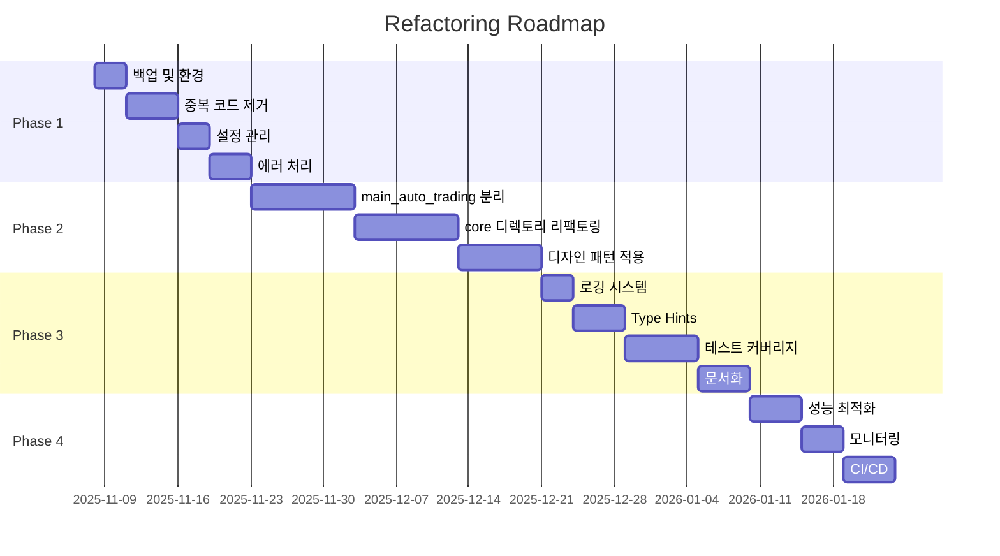

# Kiwoom Trading System - 리팩토링 로드맵

**기간**: 11-16주 (약 3-4개월)
**최종 업데이트**: 2025-11-08

---

## 🗓️ 전체 일정 Overview



---

## 📋 Phase별 우선순위 매트릭스

### Priority Matrix

```
높은 영향  │ P0: main_auto_trading  │ P1: Repository Pattern
          │     중복 코드 제거      │     디자인 패턴
          │                        │
──────────┼────────────────────────┼────────────────────────
          │ P2: 테스트 커버리지    │ P3: 문서화
낮은 영향  │     성능 최적화        │     CI/CD
          └────────────────────────┴────────────────────────
             빠른 ROI                  느린 ROI
```

### Priority Levels

**P0 - Critical (즉시 시작)**:
- main_auto_trading.py 분리 (124KB)
- 중복 코드 제거 (데이터 수집, 검증)
- core/ God Objects 분리

**P1 - High (다음 단계)**:
- Repository Pattern 구현
- 설정 관리 (Magic Numbers 제거)
- 에러 처리 표준화
- 디자인 패턴 적용

**P2 - Medium (병행 가능)**:
- 테스트 커버리지 향상
- Type Hints 추가
- 로깅 시스템

**P3 - Low (여유 있을 때)**:
- 문서화
- 성능 최적화
- CI/CD 구축

---

## 🎯 Sprint별 상세 로드맵

### **Phase 1: 안정화 (Week 1-3)**

#### Sprint 1.1: 백업 및 환경 설정
**기간**: Day 1-3
**담당**: DevOps
**목표**: 안전한 리팩토링 환경 구축

| Task ID | Task | 예상 시간 | 의존성 | 상태 |
|---------|------|-----------|--------|------|
| 1.1.1 | 프로젝트 전체 백업 | 2h | - | ⬜️ |
| 1.1.2 | Git 태그 생성 | 0.5h | 1.1.1 | ⬜️ |
| 1.1.3 | requirements.txt 분리 | 2h | - | ⬜️ |
| 1.1.4 | pytest 환경 구축 | 3h | - | ⬜️ |
| 1.1.5 | .coveragerc 설정 | 1h | 1.1.4 | ⬜️ |

**Deliverables**:
- ✅ 백업 디렉토리 (`backups/pre-refactoring-YYYYMMDD/`)
- ✅ `requirements.txt`, `requirements-dev.txt`
- ✅ `pytest.ini`, `.coveragerc`
- ✅ 테스트 환경 검증

**Exit Criteria**:
- [ ] 전체 백업 완료
- [ ] 테스트 실행 가능
- [ ] 커버리지 측정 가능

---

#### Sprint 1.2: 중복 코드 제거
**기간**: Day 4-8
**담당**: Backend Developer
**목표**: DRY 원칙 적용, 코드 중복 최소화

| Task ID | Task | 예상 시간 | 의존성 | 상태 |
|---------|------|-----------|--------|------|
| 1.2.1 | StockDataFetcher 설계 | 4h | 1.1.5 | ⬜️ |
| 1.2.2 | StockDataFetcher 구현 | 8h | 1.2.1 | ⬜️ |
| 1.2.3 | main_auto_trading 적용 | 4h | 1.2.2 | ⬜️ |
| 1.2.4 | main_condition_filter 적용 | 4h | 1.2.2 | ⬜️ |
| 1.2.5 | analyzers 적용 | 4h | 1.2.2 | ⬜️ |
| 1.2.6 | StockValidator 구현 | 6h | 1.2.1 | ⬜️ |
| 1.2.7 | WebSocketManager 구현 | 6h | 1.2.1 | ⬜️ |
| 1.2.8 | 테스트 작성 | 8h | 1.2.3-7 | ⬜️ |

**Deliverables**:
- ✅ `utils/stock_data_fetcher.py`
- ✅ `validators/stock_validator.py`
- ✅ `core/websocket_manager.py`
- ✅ 테스트 파일 (커버리지 > 80%)

**Exit Criteria**:
- [ ] 3개 파일에서 중복 코드 제거
- [ ] 모든 테스트 통과
- [ ] 기존 기능 정상 동작

---

#### Sprint 1.3: 설정 관리 개선
**기간**: Day 9-11
**담당**: Backend Developer
**목표**: Magic Numbers 제거, 중앙화된 설정 관리

| Task ID | Task | 예상 시간 | 의존성 | 상태 |
|---------|------|-----------|--------|------|
| 1.3.1 | trading_config.yaml 설계 | 3h | - | ⬜️ |
| 1.3.2 | ConfigLoader 구현 | 4h | 1.3.1 | ⬜️ |
| 1.3.3 | EnvConfig 구현 | 3h | 1.3.1 | ⬜️ |
| 1.3.4 | Magic Numbers 추출 | 8h | 1.3.2 | ⬜️ |
| 1.3.5 | .env.example 생성 | 2h | 1.3.3 | ⬜️ |
| 1.3.6 | 테스트 작성 | 4h | 1.3.4 | ⬜️ |

**Deliverables**:
- ✅ `config/trading_config.yaml`
- ✅ `config/config_loader.py`
- ✅ `config/env_config.py`
- ✅ `.env.example`

**Exit Criteria**:
- [ ] 모든 Magic Numbers 제거
- [ ] 환경별 설정 지원 (dev/prod)
- [ ] 설정 로드 테스트 통과

---

#### Sprint 1.4: 에러 처리 표준화
**기간**: Day 12-15
**담당**: Backend Developer
**목표**: 일관된 예외 처리 및 에러 핸들링

| Task ID | Task | 예상 시간 | 의존성 | 상태 |
|---------|------|-----------|--------|------|
| 1.4.1 | 커스텀 예외 정의 | 4h | - | ⬜️ |
| 1.4.2 | 에러 핸들러 데코레이터 | 6h | 1.4.1 | ⬜️ |
| 1.4.3 | kiwoom_api.py 적용 | 6h | 1.4.2 | ⬜️ |
| 1.4.4 | trading_manager.py 적용 | 4h | 1.4.2 | ⬜️ |
| 1.4.5 | analyzers/ 적용 | 6h | 1.4.2 | ⬜️ |
| 1.4.6 | 테스트 작성 | 6h | 1.4.3-5 | ⬜️ |

**Deliverables**:
- ✅ `exceptions/trading_exceptions.py`
- ✅ `exceptions/error_handler.py`
- ✅ 모든 API 호출에 에러 처리 적용

**Exit Criteria**:
- [ ] 일관된 예외 처리
- [ ] 에러 로깅 표준화
- [ ] 예외 테스트 통과

---

### **Phase 2: 구조 개선 (Week 4-9)**

#### Sprint 2.1: main_auto_trading.py 분리
**기간**: Week 4-5 (10일)
**담당**: Backend Team
**목표**: 2,767 라인 → 8개 모듈로 분리

**Day 1-2: 아키텍처 설계**
| Task ID | Task | 예상 시간 | 상태 |
|---------|------|-----------|------|
| 2.1.1 | 모듈 책임 정의 | 4h | ⬜️ |
| 2.1.2 | 인터페이스 설계 | 6h | ⬜️ |
| 2.1.3 | 의존성 다이어그램 | 4h | ⬜️ |

**Day 3-7: 모듈 구현**
| Task ID | Task | 예상 시간 | 상태 |
|---------|------|-----------|------|
| 2.1.4 | websocket_manager.py | 8h | ⬜️ |
| 2.1.5 | condition_filter.py | 10h | ⬜️ |
| 2.1.6 | vwap_validator.py | 8h | ⬜️ |
| 2.1.7 | order_executor.py | 12h | ⬜️ |
| 2.1.8 | monitoring_service.py | 10h | ⬜️ |
| 2.1.9 | trading_coordinator.py | 12h | ⬜️ |
| 2.1.10 | main.py | 4h | ⬜️ |

**Day 8-10: 테스트**
| Task ID | Task | 예상 시간 | 상태 |
|---------|------|-----------|------|
| 2.1.11 | 단위 테스트 (각 모듈) | 16h | ⬜️ |
| 2.1.12 | 통합 테스트 | 8h | ⬜️ |
| 2.1.13 | 회귀 테스트 | 4h | ⬜️ |

**Deliverables**:
- ✅ `trading/` 디렉토리 (8개 모듈)
- ✅ 테스트 커버리지 > 80%
- ✅ 아키텍처 문서

**Exit Criteria**:
- [ ] main_auto_trading.py < 100 lines
- [ ] 모든 테스트 통과
- [ ] 기존 기능 100% 동작

**Risk Mitigation**:
- 매일 회귀 테스트 실행
- 각 모듈 완성 시 즉시 테스트
- 문제 발생 시 롤백 가능

---

#### Sprint 2.2: core/ 디렉토리 리팩토링
**기간**: Week 6-7 (10일)
**담당**: Backend Team
**목표**: God Objects 제거, Repository Pattern 적용

**Day 1-4: db_auto_trading_handler.py**
| Task ID | Task | 예상 시간 | 상태 |
|---------|------|-----------|------|
| 2.2.1 | Repository 설계 | 6h | ⬜️ |
| 2.2.2 | BaseRepository 구현 | 4h | ⬜️ |
| 2.2.3 | StockRepository 구현 | 6h | ⬜️ |
| 2.2.4 | TradeRepository 구현 | 6h | ⬜️ |
| 2.2.5 | PositionRepository 구현 | 6h | ⬜️ |
| 2.2.6 | 기존 코드 마이그레이션 | 8h | ⬜️ |

**Day 5-7: menu_handlers.py**
| Task ID | Task | 예상 시간 | 상태 |
|---------|------|-----------|------|
| 2.2.7 | 핸들러 분리 설계 | 4h | ⬜️ |
| 2.2.8 | TradingHandler 구현 | 6h | ⬜️ |
| 2.2.9 | AnalysisHandler 구현 | 6h | ⬜️ |
| 2.2.10 | BacktestHandler 구현 | 6h | ⬜️ |
| 2.2.11 | 기존 코드 마이그레이션 | 6h | ⬜️ |

**Day 8-10: trading_system.py**
| Task ID | Task | 예상 시간 | 상태 |
|---------|------|-----------|------|
| 2.2.12 | Service Layer 설계 | 4h | ⬜️ |
| 2.2.13 | TradingService 구현 | 8h | ⬜️ |
| 2.2.14 | AnalysisService 구현 | 8h | ⬜️ |
| 2.2.15 | 기존 코드 마이그레이션 | 6h | ⬜️ |
| 2.2.16 | 테스트 작성 | 12h | ⬜️ |

**Deliverables**:
- ✅ `repositories/` (6개 클래스)
- ✅ `handlers/` (5개 클래스)
- ✅ `services/` (4개 클래스)

**Exit Criteria**:
- [ ] 모든 God Objects 제거
- [ ] 테스트 커버리지 > 75%
- [ ] 데이터베이스 마이그레이션 완료

---

#### Sprint 2.3: 디자인 패턴 적용
**기간**: Week 8-9 (8일)
**담당**: Senior Developer
**목표**: 확장 가능한 아키텍처 구축

**Day 1-3: Command Pattern**
| Task ID | Task | 예상 시간 | 상태 |
|---------|------|-----------|------|
| 2.3.1 | Command 인터페이스 설계 | 4h | ⬜️ |
| 2.3.2 | BuyOrderCommand 구현 | 4h | ⬜️ |
| 2.3.3 | SellOrderCommand 구현 | 4h | ⬜️ |
| 2.3.4 | CommandInvoker 구현 | 4h | ⬜️ |
| 2.3.5 | OrderExecutor 통합 | 6h | ⬜️ |
| 2.3.6 | 테스트 작성 | 6h | ⬜️ |

**Day 4-6: Observer Pattern**
| Task ID | Task | 예상 시간 | 상태 |
|---------|------|-----------|------|
| 2.3.7 | Observer 인터페이스 설계 | 4h | ⬜️ |
| 2.3.8 | PriceSubject 구현 | 4h | ⬜️ |
| 2.3.9 | StopLossObserver 구현 | 4h | ⬜️ |
| 2.3.10 | TakeProfitObserver 구현 | 4h | ⬜️ |
| 2.3.11 | MonitoringService 통합 | 6h | ⬜️ |
| 2.3.12 | 테스트 작성 | 6h | ⬜️ |

**Day 7-8: State Pattern**
| Task ID | Task | 예상 시간 | 상태 |
|---------|------|-----------|------|
| 2.3.13 | TradingState 인터페이스 | 3h | ⬜️ |
| 2.3.14 | WatchingState 구현 | 2h | ⬜️ |
| 2.3.15 | HoldingState 구현 | 2h | ⬜️ |
| 2.3.16 | TradingContext 구현 | 4h | ⬜️ |
| 2.3.17 | 기존 코드 통합 | 4h | ⬜️ |
| 2.3.18 | 테스트 작성 | 4h | ⬜️ |

**Deliverables**:
- ✅ `patterns/commands.py`
- ✅ `patterns/observers.py`
- ✅ `patterns/states.py`

**Exit Criteria**:
- [ ] 3개 패턴 구현 완료
- [ ] 기존 코드와 통합
- [ ] 패턴별 테스트 통과

---

### **Phase 3: 품질 향상 (Week 10-13)**

#### Sprint 3.1: 로깅 시스템 구축
**기간**: Week 10 (3일)
**담당**: DevOps
**목표**: 구조화된 로깅 및 모니터링

| Task ID | Task | 예상 시간 | 상태 |
|---------|------|-----------|------|
| 3.1.1 | StructuredLogger 구현 | 6h | ⬜️ |
| 3.1.2 | JsonFormatter 구현 | 4h | ⬜️ |
| 3.1.3 | 로그 로테이션 설정 | 4h | ⬜️ |
| 3.1.4 | 전체 코드베이스 적용 | 8h | ⬜️ |
| 3.1.5 | 테스트 작성 | 4h | ⬜️ |

**Deliverables**:
- ✅ `utils/logger.py`
- ✅ 로그 설정 파일
- ✅ 로그 분석 도구

**Exit Criteria**:
- [ ] 모든 print → logger 전환
- [ ] JSON 로그 포맷 적용
- [ ] 로그 레벨 관리

---

#### Sprint 3.2: Type Hints 추가
**기간**: Week 10-11 (5일)
**담당**: All Developers
**목표**: 100% Type Hints 커버리지

| Task ID | Task | 예상 시간 | 상태 |
|---------|------|-----------|------|
| 3.2.1 | mypy.ini 설정 | 2h | ⬜️ |
| 3.2.2 | core/ Type Hints | 12h | ⬜️ |
| 3.2.3 | trading/ Type Hints | 10h | ⬜️ |
| 3.2.4 | analyzers/ Type Hints | 8h | ⬜️ |
| 3.2.5 | utils/ Type Hints | 6h | ⬜️ |
| 3.2.6 | mypy 검사 통과 | 8h | ⬜️ |

**Deliverables**:
- ✅ `mypy.ini`
- ✅ 전체 코드베이스 Type Hints

**Exit Criteria**:
- [ ] mypy 검사 통과
- [ ] 100% 함수 타입 힌트
- [ ] Type stub 파일 생성

---

#### Sprint 3.3: 테스트 커버리지 향상
**기간**: Week 11-12 (7일)
**담당**: All Developers
**목표**: > 80% 커버리지

**우선순위별 테스트**:
| 우선순위 | 모듈 | 예상 시간 | 상태 |
|---------|------|-----------|------|
| P0 | trading/ | 12h | ⬜️ |
| P0 | repositories/ | 10h | ⬜️ |
| P1 | kiwoom_api.py | 8h | ⬜️ |
| P1 | analyzers/ | 12h | ⬜️ |
| P2 | utils/ | 8h | ⬜️ |
| P2 | handlers/ | 6h | ⬜️ |

**Deliverables**:
- ✅ 200+ 테스트 케이스
- ✅ 커버리지 리포트 (HTML)

**Exit Criteria**:
- [ ] 커버리지 > 80%
- [ ] 모든 테스트 통과
- [ ] CI 통합

---

#### Sprint 3.4: 문서화
**기간**: Week 12-13 (5일)
**담당**: Tech Writer
**목표**: 완전한 문서화

| Task ID | Task | 예상 시간 | 상태 |
|---------|------|-----------|------|
| 3.4.1 | Sphinx 설정 | 4h | ⬜️ |
| 3.4.2 | API 문서 자동 생성 | 6h | ⬜️ |
| 3.4.3 | 아키텍처 문서 작성 | 8h | ⬜️ |
| 3.4.4 | 사용자 가이드 작성 | 12h | ⬜️ |
| 3.4.5 | 개발자 가이드 작성 | 10h | ⬜️ |

**Deliverables**:
- ✅ `docs/` 디렉토리
- ✅ API 문서 (HTML)
- ✅ README 업데이트

**Exit Criteria**:
- [ ] Sphinx 문서 빌드 성공
- [ ] 모든 API 문서화
- [ ] 가이드 문서 완료

---

### **Phase 4: 고도화 (Week 14-16)**

#### Sprint 4.1: 성능 최적화
**기간**: Week 14 (5일)
**담당**: Backend Team
**목표**: 응답 시간 50% 단축

| Task ID | Task | 예상 시간 | 상태 |
|---------|------|-----------|------|
| 4.1.1 | 프로파일링 (cProfile) | 4h | ⬜️ |
| 4.1.2 | 데이터베이스 인덱스 | 6h | ⬜️ |
| 4.1.3 | 쿼리 최적화 | 8h | ⬜️ |
| 4.1.4 | 비동기 병렬 처리 | 10h | ⬜️ |
| 4.1.5 | 캐싱 전략 | 8h | ⬜️ |
| 4.1.6 | 벤치마크 | 4h | ⬜️ |

**Deliverables**:
- ✅ 성능 벤치마크 리포트
- ✅ 최적화된 코드

**Exit Criteria**:
- [ ] 응답 시간 50% 감소
- [ ] 데이터베이스 쿼리 최적화
- [ ] 벤치마크 통과

---

#### Sprint 4.2: 모니터링 및 알림
**기간**: Week 15 (4일)
**담당**: DevOps
**목표**: 실시간 모니터링 구축

| Task ID | Task | 예상 시간 | 상태 |
|---------|------|-----------|------|
| 4.2.1 | Prometheus 메트릭 | 6h | ⬜️ |
| 4.2.2 | Grafana 대시보드 | 8h | ⬜️ |
| 4.2.3 | 알림 규칙 설정 | 4h | ⬜️ |
| 4.2.4 | Telegram 통합 | 6h | ⬜️ |
| 4.2.5 | 헬스체크 API | 4h | ⬜️ |

**Deliverables**:
- ✅ `monitoring/metrics.py`
- ✅ Grafana 대시보드 JSON
- ✅ 알림 설정

**Exit Criteria**:
- [ ] 실시간 메트릭 수집
- [ ] 대시보드 시각화
- [ ] 알림 동작 확인

---

#### Sprint 4.3: CI/CD 구축
**기간**: Week 15-16 (5일)
**담당**: DevOps
**목표**: 자동화된 배포 파이프라인

| Task ID | Task | 예상 시간 | 상태 |
|---------|------|-----------|------|
| 4.3.1 | GitHub Actions 설정 | 6h | ⬜️ |
| 4.3.2 | 자동 테스트 파이프라인 | 6h | ⬜️ |
| 4.3.3 | 코드 품질 검사 | 4h | ⬜️ |
| 4.3.4 | 자동 배포 스크립트 | 8h | ⬜️ |
| 4.3.5 | 롤백 전략 | 4h | ⬜️ |

**Deliverables**:
- ✅ `.github/workflows/ci.yml`
- ✅ 배포 스크립트

**Exit Criteria**:
- [ ] CI 파이프라인 동작
- [ ] 자동 테스트 실행
- [ ] 자동 배포 성공

---

## 📈 진행 상황 추적

### Weekly Checkpoint

**매주 금요일 17:00 - 진행 상황 리뷰**

체크 항목:
1. 완료된 Task 수 / 전체 Task 수
2. 블로커 이슈
3. 다음 주 계획
4. 리스크 평가

### Daily Standup (Optional)

**매일 10:00 - 15분**

체크 항목:
1. 어제 완료한 일
2. 오늘 할 일
3. 블로커

---

## 🎯 마일스톤

| 마일스톤 | 날짜 | 주요 결과물 |
|---------|------|------------|
| M1: Phase 1 완료 | Week 3 | 중복 코드 제거, 설정 관리 개선 |
| M2: main_auto_trading 분리 | Week 5 | 8개 모듈로 분리 |
| M3: Phase 2 완료 | Week 9 | Repository Pattern, 디자인 패턴 |
| M4: 테스트 커버리지 80% | Week 12 | 품질 보증 |
| M5: Phase 4 완료 | Week 16 | CI/CD, 모니터링 |

---

## 📊 성공 지표

### KPI (Key Performance Indicators)

| 지표 | 현재 | 목표 | 측정 방법 |
|------|------|------|-----------|
| 파일 라인 수 (최대) | 4,150 | < 500 | `wc -l` |
| 테스트 커버리지 | ~30% | > 80% | `pytest --cov` |
| Type Hints | ~40% | 100% | `mypy --strict` |
| 중복 코드 | ~15% | < 5% | `pylint --duplicate` |
| 순환 의존성 | ? | 0개 | `pydeps` |
| 빌드 시간 | - | < 5분 | CI 파이프라인 |
| 테스트 실행 시간 | - | < 2분 | `pytest --durations` |

### 품질 메트릭

```bash
# 주간 품질 리포트 생성
./scripts/quality_report.sh
```

**포함 항목**:
- 코드 커버리지
- Type Hints 커버리지
- Pylint 스코어
- 중복 코드 비율
- 복잡도 (Cyclomatic Complexity)

---

## 🚨 리스크 관리 계획

### 리스크 레지스터

| ID | 리스크 | 확률 | 영향 | 완화 전략 | 책임자 |
|----|--------|------|------|-----------|--------|
| R1 | 기능 손상 | 중 | 높음 | 회귀 테스트, 단계적 배포 | QA Team |
| R2 | 일정 지연 | 높음 | 중 | 버퍼 시간 20%, 우선순위 조정 | PM |
| R3 | 의존성 충돌 | 낮음 | 중 | 가상 환경, 버전 고정 | DevOps |
| R4 | 데이터 손실 | 낮음 | 높음 | 일일 백업, 마이그레이션 테스트 | DBA |
| R5 | 팀원 이탈 | 낮음 | 높음 | 문서화, 지식 공유 | TL |
| R6 | 성능 저하 | 중 | 중 | 벤치마크, 프로파일링 | Backend |

### 롤백 절차

```bash
# 1. Git 롤백
git checkout <tag_name>

# 2. 데이터베이스 복원
./scripts/restore_db.sh <backup_date>

# 3. 의존성 복원
pip install -r requirements-frozen.txt

# 4. 서비스 재시작
./scripts/restart_service.sh
```

---

## 📅 리뷰 및 회고

### Sprint Retrospective

**매 Sprint 종료 시 (2주마다)**

체크 항목:
1. ✅ **잘된 점** (Keep)
2. ⚠️ **개선할 점** (Problem)
3. 💡 **시도할 것** (Try)

### Phase Retrospective

**각 Phase 종료 시**

체크 항목:
1. 목표 달성도
2. 예상 vs 실제 시간
3. 주요 학습 내용
4. 다음 Phase 개선 사항

---

## 🔄 변경 관리

### 계획 변경 프로세스

1. **변경 요청** (Change Request)
   - 변경 사유
   - 영향 분석
   - 대안 평가

2. **승인** (Approval)
   - PM 검토
   - 이해관계자 승인

3. **업데이트** (Update)
   - 로드맵 업데이트
   - 팀 공유
   - 문서 갱신

---

## 📞 커뮤니케이션 계획

### 보고 체계

**일일**:
- Standup (Slack)

**주간**:
- 진행 상황 리포트 (Friday 17:00)
- 주간 메트릭 리포트 (자동 생성)

**Sprint**:
- Sprint Planning (Sprint 시작일)
- Sprint Review (Sprint 종료일)
- Sprint Retrospective (Sprint 종료일)

**Phase**:
- Phase Kickoff
- Phase Review
- Phase Retrospective

---

## 🎓 학습 자료

### 추천 리소스

**디자인 패턴**:
- "Design Patterns: Elements of Reusable Object-Oriented Software"
- refactoring.guru

**리팩토링**:
- "Refactoring: Improving the Design of Existing Code" - Martin Fowler
- "Working Effectively with Legacy Code" - Michael Feathers

**테스팅**:
- pytest 공식 문서
- "Test Driven Development" - Kent Beck

**Python Best Practices**:
- PEP 8 - Style Guide
- "Effective Python" - Brett Slatkin

---

## 🏁 최종 목표

### Phase 4 종료 시 달성 상태

```
✅ 코드 품질
  ├── ✅ 파일 라인 수 < 500
  ├── ✅ 테스트 커버리지 > 80%
  ├── ✅ Type Hints 100%
  ├── ✅ 중복 코드 < 5%
  └── ✅ 순환 의존성 0개

✅ 아키텍처
  ├── ✅ Repository Pattern 적용
  ├── ✅ Service Layer 분리
  ├── ✅ 디자인 패턴 적용
  └── ✅ 모듈화 완료

✅ 인프라
  ├── ✅ CI/CD 파이프라인
  ├── ✅ 모니터링 대시보드
  ├── ✅ 로깅 시스템
  └── ✅ 자동화된 테스트

✅ 문서화
  ├── ✅ API 문서
  ├── ✅ 아키텍처 문서
  ├── ✅ 사용자 가이드
  └── ✅ 개발자 가이드
```

---

**작성자**: Claude Code Assistant
**버전**: 1.0
**최종 업데이트**: 2025-11-08
